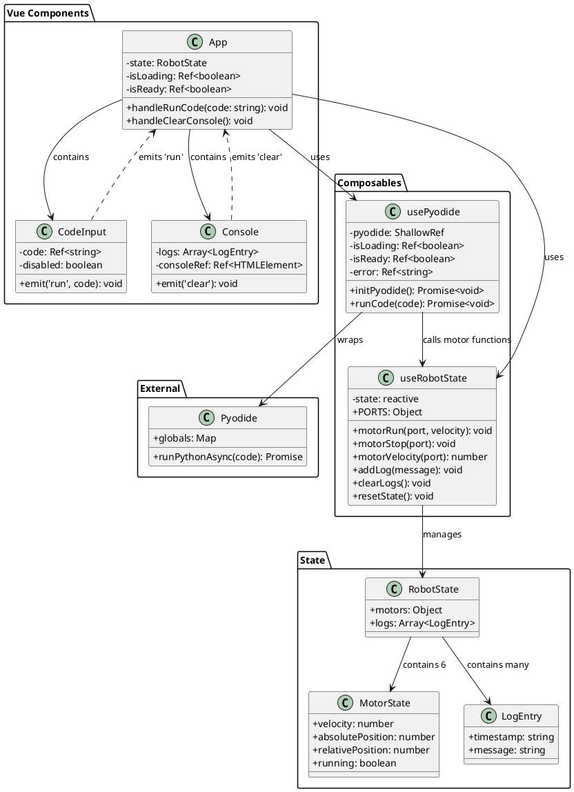
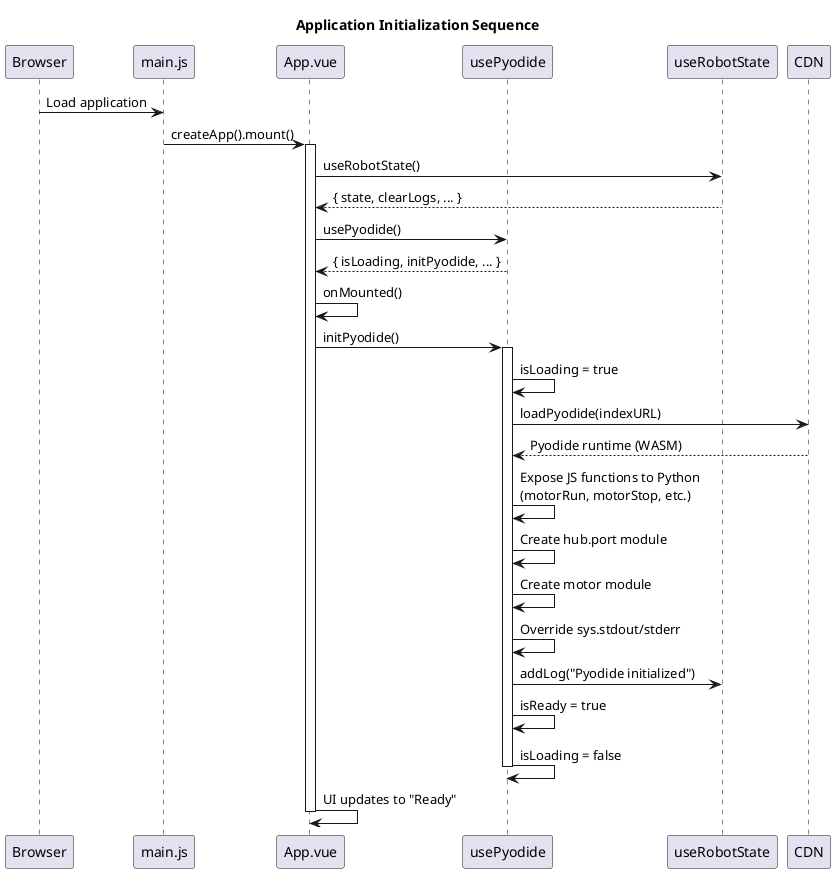
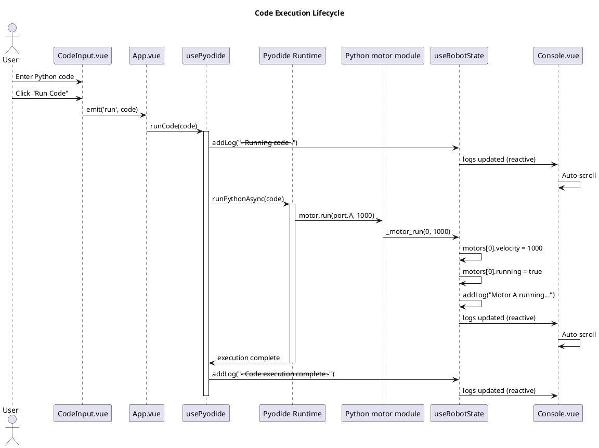
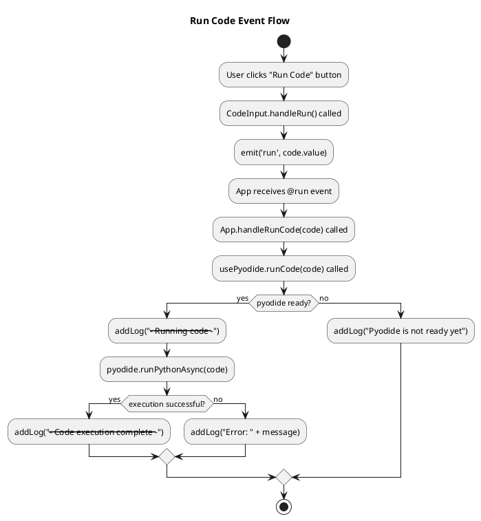
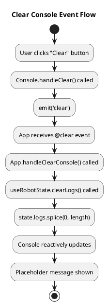
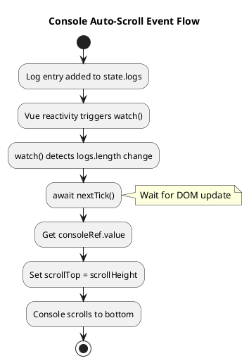
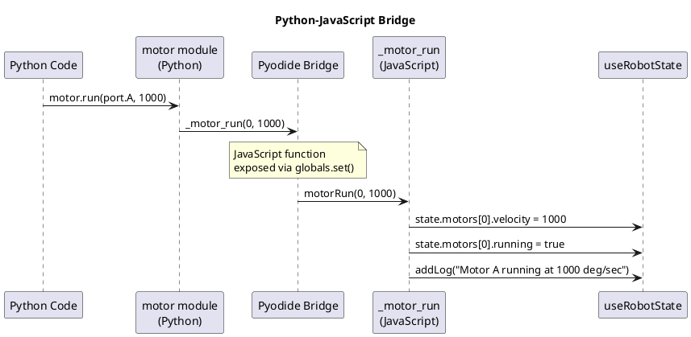

# LEGO Spike Prime Simulator - Code Documentation

## Overview

This is a web-based simulator for testing Python code before deploying it to real LEGO Spike Prime robots. The application runs entirely in the browser using Vue 3 for the UI framework and Pyodide for executing Python code via WebAssembly.

## Source Files

| File | Purpose |
|------|---------|
| `src/main.js` | Vue application entry point |
| `src/App.vue` | Root component, orchestrates the application |
| `src/components/CodeInput.vue` | Python code editor with Run button |
| `src/components/Console.vue` | Output log display |
| `src/composables/useRobotState.js` | Robot state management (motors, logs) |
| `src/composables/usePyodide.js` | Python execution engine via Pyodide |

---

# Input and Output

## Input

### Command-line Flags
This is a client-side web application with no command-line interface. Development commands are:
- `npm run dev` - Start development server
- `npm run build` - Build for production
- `npm run preview` - Preview production build

### Configuration
| Source | Configuration |
|--------|---------------|
| `vite.config.js` | Vite build configuration with Vue plugin |
| `package.json` | Dependencies (Vue 3, Pyodide, Vite) |
| `usePyodide.js:45` | Pyodide CDN URL: `https://cdn.jsdelivr.net/pyodide/v0.27.0/full/` |

### Data Received from External Services
| Service | Data | Purpose |
|---------|------|---------|
| Pyodide CDN (jsdelivr.net) | WebAssembly Python runtime | Enables Python execution in browser |

### User Input
| Component | Input Type | Description |
|-----------|------------|-------------|
| `CodeInput.vue` | Text (textarea) | Python code entered by user |
| `CodeInput.vue` | Click (button) | "Run Code" button triggers execution |
| `Console.vue` | Click (button) | "Clear" button clears log output |

## Output

### Data Displayed on Screen
| Component | Output | Description |
|-----------|--------|-------------|
| `App.vue` header | Status badge | "Loading Pyodide...", "Ready", or "Error" |
| `Console.vue` | Log entries | Timestamped messages from code execution |

### Log Entry Format
```
[HH:MM:SS] <message>
```

### Types of Log Messages
- `Pyodide initialized successfully` - Initialization complete
- `--- Running code ---` - Code execution started
- `Motor <port> running at <velocity> deg/sec` - Motor started
- `Motor <port> stopped` - Motor stopped
- `--- Code execution complete ---` - Code finished
- `Error: <message>` - Execution error

### Data Sent to External Services
None. This application is fully client-side and does not send data to any external services.

---

# Architecture

## PlantUML Class Diagram



## Component Relationships

```
┌─────────────────────────────────────────────────────────────┐
│                        App.vue                              │
│  ┌─────────────────────┐    ┌─────────────────────────┐    │
│  │   useRobotState()   │    │     usePyodide()        │    │
│  │   - state           │◄───│     - initPyodide()     │    │
│  │   - clearLogs()     │    │     - runCode()         │    │
│  │   - motorRun()      │    │     - isReady           │    │
│  └─────────────────────┘    └─────────────────────────┘    │
│             │                           │                   │
│             ▼                           ▼                   │
│  ┌─────────────────────┐    ┌─────────────────────────┐    │
│  │    Console.vue      │    │    CodeInput.vue        │    │
│  │    :logs="state.    │    │    :disabled="!isReady" │    │
│  │         logs"       │    │    @run="handleRunCode" │    │
│  │    @clear="handle   │    └─────────────────────────┘    │
│  │      ClearConsole"  │                                    │
│  └─────────────────────┘                                    │
└─────────────────────────────────────────────────────────────┘
```

---

# Lifecycle of Objects

## Application Lifecycle

### Phase 1: Initialization
1. Browser loads `index.html`
2. Vite serves `src/main.js`
3. Vue creates app instance and mounts `App.vue`
4. `onMounted()` hook triggers `initPyodide()`
5. Pyodide runtime loads from CDN
6. Python modules (`hub.port`, `motor`) are created
7. Status changes from "Loading..." to "Ready"

### Phase 2: User Interaction
1. User enters Python code in textarea
2. User clicks "Run Code"
3. Code executes via Pyodide
4. Motor functions update robot state
5. Logs appear in Console

### Phase 3: Cleanup
1. User clicks "Clear" to reset logs
2. User can run new code

## PlantUML Sequence Diagram - Initialization



## PlantUML Sequence Diagram - Code Execution



---

# Event Handling Logic

## Events Overview

| Event | Source | Handler | Action |
|-------|--------|---------|--------|
| Component mounted | Vue lifecycle | `App.onMounted()` | Initialize Pyodide |
| Run button click | `CodeInput.vue` | `App.handleRunCode()` | Execute Python code |
| Clear button click | `Console.vue` | `App.handleClearConsole()` | Clear log entries |
| Logs array change | `useRobotState` | `Console.watch()` | Auto-scroll to bottom |
| Code textarea input | User | `v-model` binding | Update `code` ref |

## Event Flow Diagrams

### Run Code Event



### Clear Console Event



### Auto-Scroll Event



## Python-to-JavaScript Bridge Events

When Python code calls motor functions, the following bridge occurs:



## Vue Reactivity Flow

```
User Action
    │
    ▼
Event Handler (e.g., handleRunCode)
    │
    ▼
State Mutation (e.g., state.logs.push())
    │
    ▼
Vue Reactivity System detects change
    │
    ▼
Component re-renders (Console.vue)
    │
    ▼
DOM updated
    │
    ▼
watch() callbacks triggered (auto-scroll)
```
