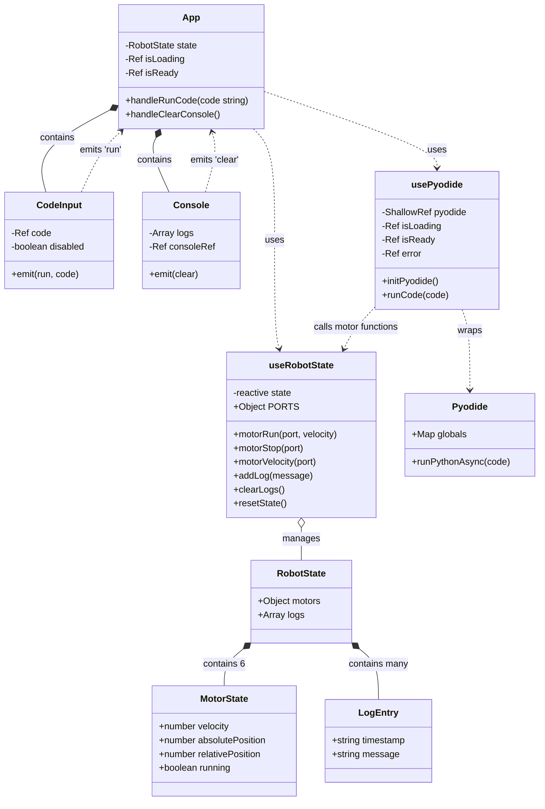
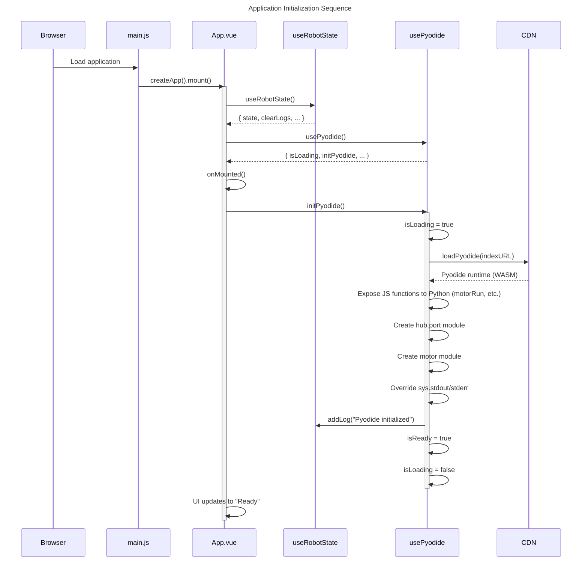
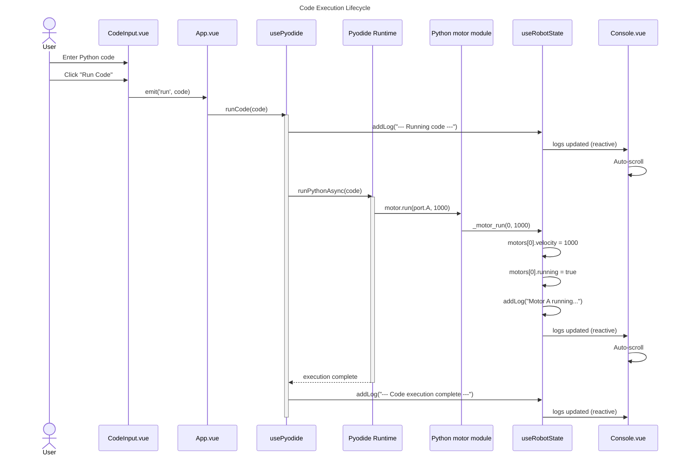
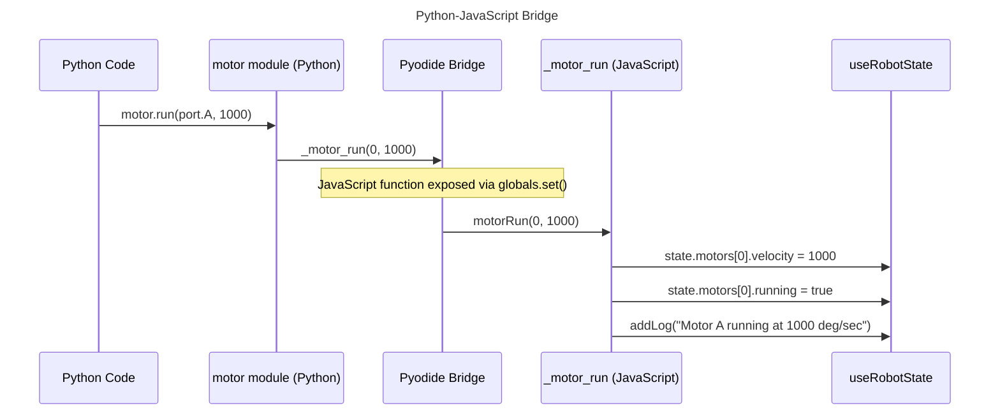

# LEGO Spike Prime Simulator - Code Documentation

## Overview

This is a web-based simulator for testing Python code before deploying it to real LEGO Spike Prime robots. The application runs entirely in the browser using Vue 3 for the UI framework and Pyodide for executing Python code via WebAssembly.

## Source Files

| File | Purpose |
| :--- | :--- |
| `src/main.js` | Vue application entry point |
| `src/App.vue` | Root component, orchestrates the application |
| `src/components/CodeInput.vue` | Python code editor with Run button |
| `src/components/Console.vue` | Output log display |
| `src/composables/useRobotState.js` | Robot state management (motors, logs) |
| `src/composables/usePyodide.js` | Python execution engine via Pyodide |

---

## Input and Output

### Input

#### Command-line Flags
This is a client-side web application with no command-line interface. Development commands are:
* `npm run dev` - Start development server
* `npm run build` - Build for production
* `npm run preview` - Preview production build

#### Configuration
| Source | Configuration |
| :--- | :--- |
| `vite.config.js` | Vite build configuration with Vue plugin |
| `package.json` | Dependencies (Vue 3, Pyodide, Vite) |
| `usePyodide.js:45` | Pyodide CDN URL |

### Output

#### Data Displayed on Screen
| Component | Output | Description |
| :--- | :--- | :--- |
| `App.vue` header | Status badge | "Loading Pyodide...", "Ready", or "Error" |
| `Console.vue` | Log entries | Timestamped messages from code execution |

---

## Architecture

### Class Diagram



### Component Relationships

```
┌─────────────────────────────────────────────────────────────┐
│                        App.vue                              │
│  ┌─────────────────────┐    ┌─────────────────────────┐    │
│  │   useRobotState()   │    │     usePyodide()        │    │
│  │   - state           │◄───│     - initPyodide()     │    │
│  │   - clearLogs()     │    │     - runCode()         │    │
│  │   - motorRun()      │    │     - isReady           │    │
│  └─────────────────────┘    └─────────────────────────┘    │
│             │                           │                   │
│             ▼                           ▼                   │
│  ┌─────────────────────┐    ┌─────────────────────────┐    │
│  │    Console.vue      │    │    CodeInput.vue        │    │
│  │    :logs="state.    │    │    :disabled="!isReady" │    │
│  │         logs"       │    │    @run="handleRunCode" │    │
│  │    @clear="handle   │    └─────────────────────────┘    │
│  │      ClearConsole"  │                                    │
│  └─────────────────────┘                                    │
└─────────────────────────────────────────────────────────────┘
```

---

## Lifecycle of Objects

### Application Lifecycle

#### Phase 1: Initialization
1. Browser loads `index.html`
2. Vite serves `src/main.js`
3. Vue creates app instance and mounts `App.vue`
4. `onMounted()` hook triggers `initPyodide()`
5. Pyodide runtime loads from CDN
6. Python modules (`hub.port`, `motor`) are created
7. Status changes from "Loading..." to "Ready"

#### Phase 2: User Interaction
1. User enters Python code in textarea
2. User clicks "Run Code"
3. Code executes via Pyodide
4. Motor functions update robot state
5. Logs appear in Console

### Initialization Sequence



### Code Execution Lifecycle



---

## Event Handling Logic

### Events Overview

| Event | Source | Handler | Action |
| :--- | :--- | :--- | :--- |
| Component mounted | Vue lifecycle | `App.onMounted()` | Initialize Pyodide |
| Run button click | `CodeInput.vue` | `App.handleRunCode()` | Execute Python code |
| Clear button click | `Console.vue` | `App.handleClearConsole()` | Clear log entries |
| Logs array change | `useRobotState` | `Console.watch()` | Auto-scroll to bottom |

### Event Flow Diagrams

#### Run Code Event

```mermaid
flowchart TD
    title Run Code Event Flow
    Start([Start]) --> UserClick[User clicks "Run Code" button]
    UserClick --> HandleRun[CodeInput.handleRun called]
    HandleRun --> Emit[emit 'run', code.value]
    Emit --> AppReceive[App receives @run event]
    AppReceive --> AppHandle[App.handleRunCode code called]
    AppHandle --> RunCode[usePyodide.runCode code called]
    
    RunCode --> Ready{pyodide ready?}
    Ready -- Yes --> AddLog[addLog '--- Running code ---']
    AddLog --> Exec[pyodide.runPythonAsync code]
    
    Exec --> Success{execution successful?}
    Success -- Yes --> CompleteLog[addLog '--- Code execution complete ---']
    Success -- No --> ErrorLog[addLog 'Error: ' + message]
    
    Ready -- No --> NotReadyLog[addLog 'Pyodide is not ready yet']
    
    CompleteLog --> Stop([Stop])
    ErrorLog --> Stop
    NotReadyLog --> Stop
```

#### Clear Console Event

```mermaid
flowchart TD
    title Clear Console Event Flow
    Start([Start]) --> Click[User clicks "Clear" button]
    Click --> HandleClear[Console.handleClear called]
    HandleClear --> Emit[emit 'clear']
    Emit --> AppReceive[App receives @clear event]
    AppReceive --> AppHandle[App.handleClearConsole called]
    AppHandle --> ClearLogs[useRobotState.clearLogs called]
    ClearLogs --> Splice[state.logs.splice 0, length]
    Splice --> Reactive[Console reactively updates]
    Reactive --> Placeholder[Placeholder message shown]
    Placeholder --> Stop([Stop])
```

#### Auto-Scroll Event

```mermaid
flowchart TD
    title Console Auto-Scroll Event Flow
    Start([Start]) --> LogAdded[Log entry added to state.logs]
    LogAdded --> Reactivity[Vue reactivity triggers watch]
    Reactivity --> Watch[watch detects logs.length change]
    Watch --> NextTick[await nextTick]
    NextTick --> DOMUpdate[Wait for DOM update]
    DOMUpdate --> GetRef[Get consoleRef.value]
    GetRef --> Scroll[Set scrollTop = scrollHeight]
    Scroll --> End([Console scrolls to bottom])
```

### Python-to-JavaScript Bridge Events



### Vue Reactivity Flow

```
User Action
    │
    ▼
Event Handler (e.g., handleRunCode)
    │
    ▼
State Mutation (e.g., state.logs.push())
    │
    ▼
Vue Reactivity System detects change
    │
    ▼
Component re-renders (Console.vue)
    │
    ▼
DOM updated
    │
    ▼
watch() callbacks triggered (auto-scroll)
```
